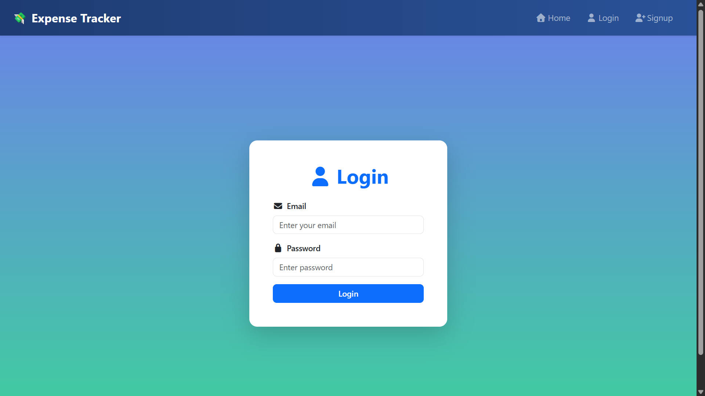
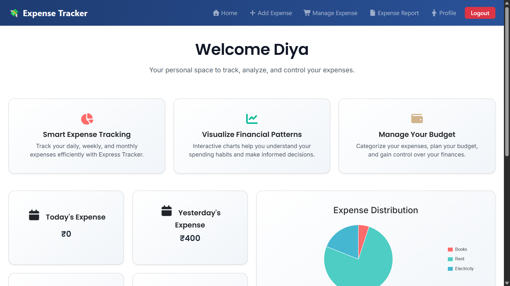
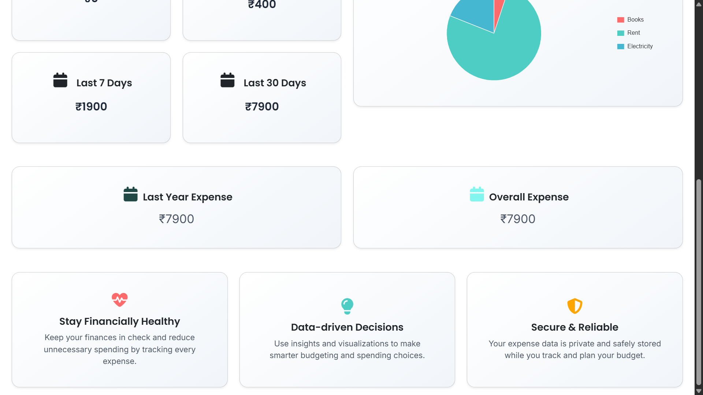
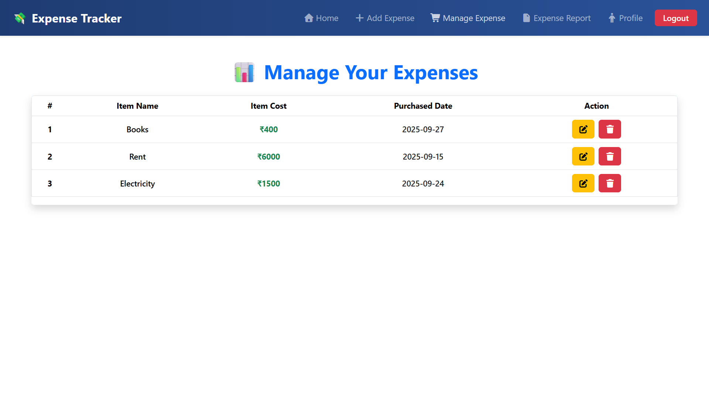
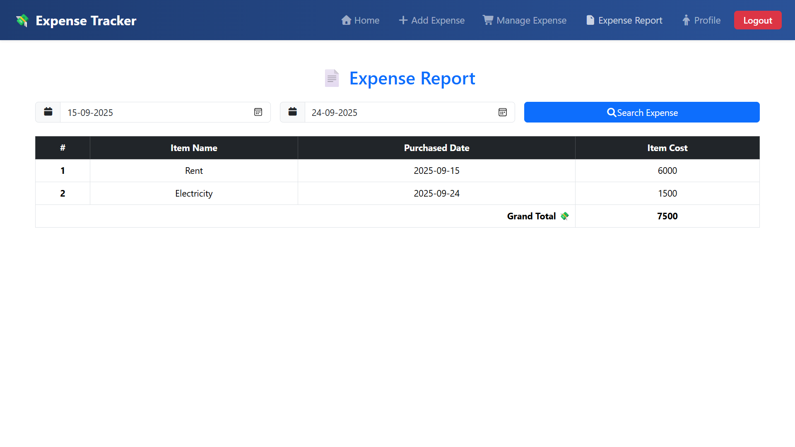

# Daily Expense Tracker
A full-stack web application to record, monitor, and manage daily expenses.

## Tech Stack
- Backend: Django (Python)
- Frontend: React
- Database: SQLite
- Charts: Chart.js
- Styling: Bootstrap + FontAwesome

## Features
- Add, edit, delete, and view daily expenses
- Filter expenses by date
- Visualize spending trends using charts

# For the Setup

## Backend
cd backend

pip install -r requirements.txt
python manage.py migrate
python manage.py runserver

## Frontend
cd frontend

npm install
npm start

# Screenshots

## Login

## Dashboard

## Manage Expense

## Expense Report

